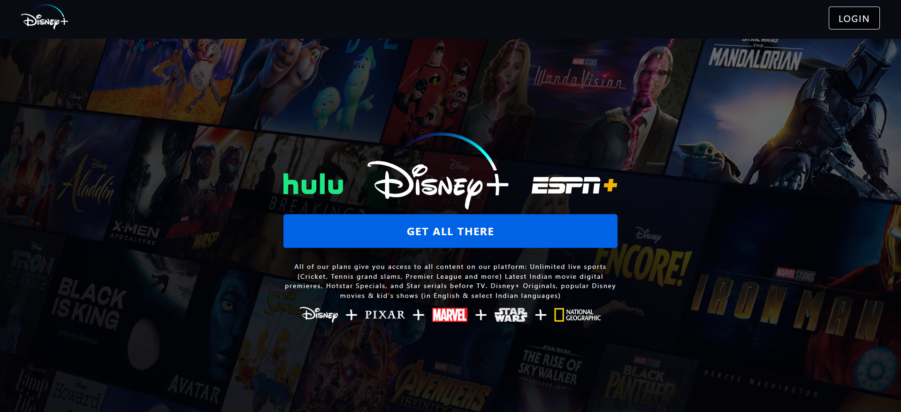
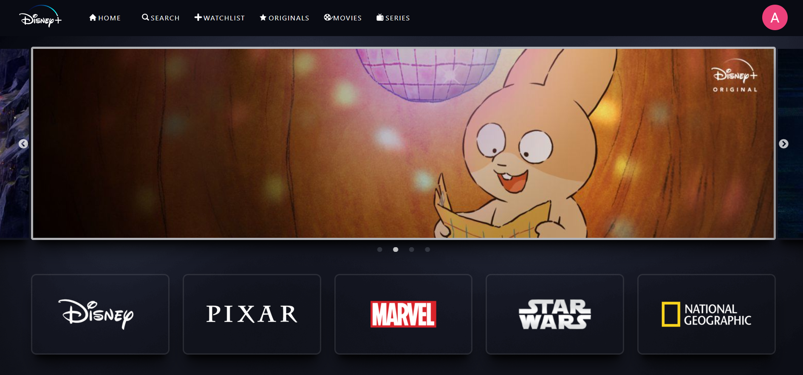
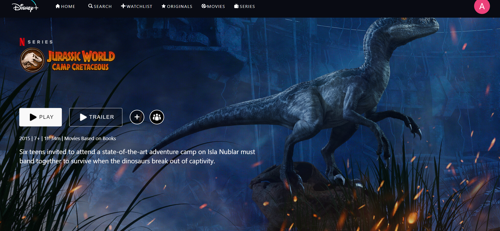

# Disney-Plus-Clone

A web Application that Replicates the Disney+ Hotstar Website

This project uses HTML, CSS, and JavaScript to create a responsive and interactive user interface that allows the user to browse and watch movies and shows from various categories and genres.

Here's a live deployment - https://disney-plus-45419.web.app/

<center>
    
</center>

<center>
    
</center>

<center>
    
</center>

## Tech-Stack

- React
- HTML
- CSS
- Firebase
- Redux
- Styled-Components

## Features

- The application mimics the layout and style of the Disney+ Hotstar website, with a logo, a navigation bar and a banner.
- The application allows the user to click on any movie to show poster and see its title, rating, genre, and description, and shows more details and options, such as play, add to watchlist, share, etc.

## Installation and Usage

To install and run this project, you need to have Nodejs installed on your computer.

To download the code for this project, you can clone this GitHub repository using the following command:

```git clone https://github.com/Amritha-07/Disney-Plus-Clone.git```

To build Dependencies

```npm install```

or 

```npm run build```

To start the application

```npm start```

## References

- [ASMR | Build Disney+ with React JS (Firebase + Styled Components + Redux)](https://www.youtube.com/watch?v=R_OERlafbmw) from Clever Programmer